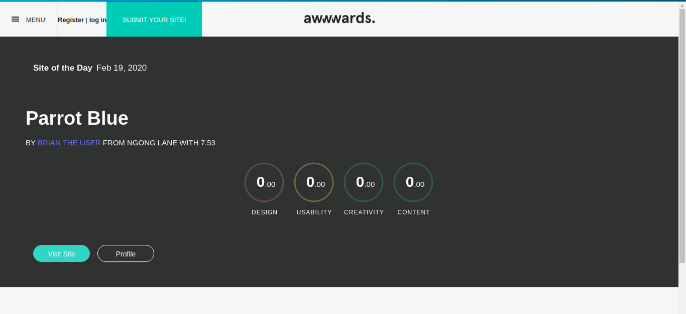

# Project: Awwards

## Author: Brian Mutuma


  
# Description  
This is a project where users are able post their projects, view other projects, review them and rate them

##  Live Link  

  

 
## User Story  
  
* Sign in to the application to start using.  
* Upload a pictures to the application. 
* Review different projects
* See your profile with all your projects.  
* See other projects posted 

#### App screenshot


# Behaviour Driven Development

| Input        | Output           | Behavior  |
| ------------- |:-------------:| -----:|
| Visit awwwards-clone site| Various projects are displayed  | User can review projects |
| Click on image| Image details displayed | Image details displayed |
| Search project | Images for project are displayed | App gets the projects for the searched project |
| Visit profile | Projects posted by user are displayed | App gets projects for user |
| Visit Admin | Prompts for admin credentials | Admin dashboard displayed |
| API projects | api with a list of projects is displayed | api displayed |


## Technologies used
* Django-a python frame-work
* Javascript
* Html
* Bootstrap
* Postman for visual representaion while building the api
  

  
## Setup and Installation  
To get the project .......  
  
##### Cloning the repository:  
 ```bash 
 https://github.com/Brian-M-code/projectsrate.git
```
##### Navigate into the folder and install requirements  
 ```bash 
cd instagram pip install -r requirements.txt 
```
##### Install and activate Virtual  
 ```bash 
- python3 -m venv virtual - source virtual/bin/activate  
```  
##### Install Dependencies  
 ```bash 
 pip install -r requirements.txt 
```  
 ##### Setup Database  
  SetUp your database User,Password, Host then make migrate  
 ```bash 
python manage.py makemigrations instagram
 ``` 
 Now Migrate  
 ```bash 
 python manage.py migrate 
```
##### Run the application  
 ```bash 
 python manage.py runserver 
``` 
##### Running the application  
 ```bash 
 python manage.py server 
```
##### Testing the application  
 ```bash 
 python manage.py test 
```
Open the application on your browser `127.0.0.1:8000`.  
  
  
## Technology used  
  
* [Python3.6](https://www.python.org/)  
* [Django 1.11](https://docs.djangoproject.com/en/2.2/)  
* [Heroku](https://heroku.com)  
  
  
## Known Bugs  
* Images are not rendering correctly
* For now the submit and redirection have issues.
  
## Contact Information   
If you have any question or contributions, please email me at [mutuma.brian@yahoo.com.com]  
  
## License 


* Copyright (c) 2019 **Brian-M-Code**